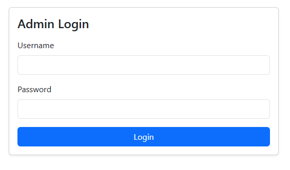
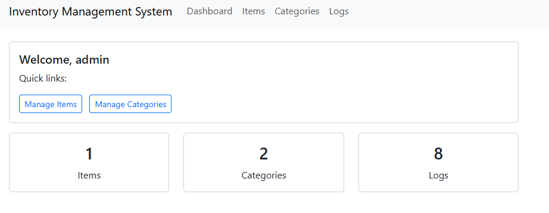
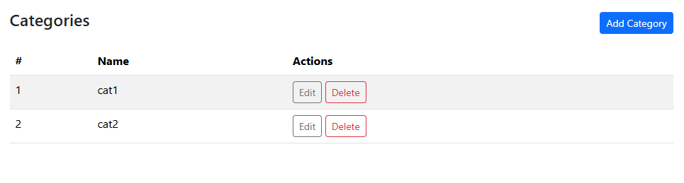
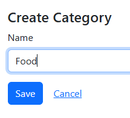
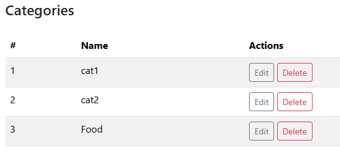
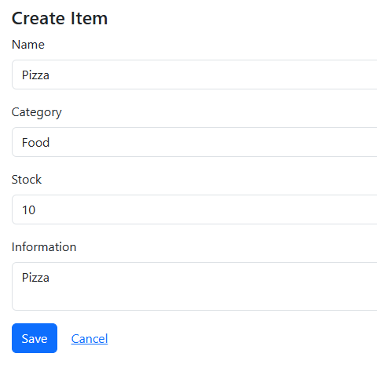
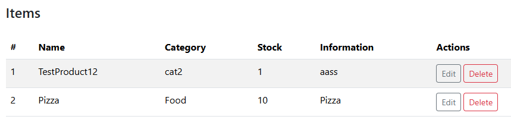

  

  
  
  
  

# Inventory Management System

## Project Description / Overview
The **Inventory Management System** is a web-based application built with **Laravel** that allows users to manage products, categories, and stock levels efficiently.  
It includes an integrated logging system that automatically records all item and category modifications for transparent tracking and audit purposes.

---

## Features

### Core Modules
- **Item Management**
  - Create, edit, and delete items.
  - Track item category, stock count, and descriptive information.
  - Automatically log all actions (creation, updates, and deletion).
- **Category Management**
  - Create, rename, and delete categories.
  - Category changes are also logged independently.

### Logging System
- Automatically generates a log entry for every action:
  - Item created, updated, or deleted.
  - Category created, renamed, or deleted.
- Logs are stored in the database and linked via `batch_id` for grouped actions.
- Keeps logs even when related items are deleted (via snapshot data).

---

## Installation Instructions

### Prerequisites
- PHP ≥ 8.1  
- Composer  
- MySQL / XAMPP  
- Laravel  

### Installation
1. Clone or copy the project folder to your local environment.  
2. Create and configure your `.env` file.  
3. Generate an application key.  
4. Run migrations and seeder.  
5. Start the local development server.

---

## Usage

### Login Page
  
Default credentials:  
- **Username:** admin  
- **Password:** adminpass  

Accounts can only be made directly in the database.  
This system is for demonstration purposes only.

### Dashboard
On successful login, the homepage will appear.  

### Example of Item Creation

#### Creating a new category
  
  

#### Adding new item
  

#### Automatic logging

---

## Contributors
Developer: Jan Robert Buccat  

---

## License
This project is open-source and distributed under the **MIT License**.
